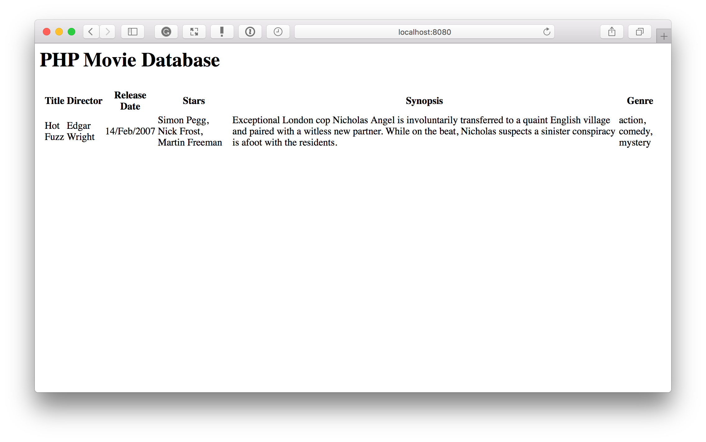

# Expressive Essentials Skeleton App Manual Build

This repository shows the manual version of the Zend Expressive application, that's developed in Zend Expressive Essentials.

## Prerequisites

There are two prerequisites for this project:

- [Git](https://git-scm.com), as you need to clone the source.
- [Docker](https://docs.docker.com/engine/installation/#supported-platforms), as that provides a complete runtime environment for running the code.

## Installation

To install it, clone the source as follows:

```console
git clone git@github.com:zfmastery/expressive-essentials-skeleton-app-manual-build.git expressive-essentials-manual-build
```

## Running the Application

Running the application, currently, requires Docker.
If you've never used Docker before, [you need to install it](https://docs.docker.com/engine/installation/#supported-platforms).
The Docker website has plenty of instructions about doing so, no matter if you're on *Windows*, *macOS*, or *Linux*.
After you've installed Docker, from the terminal, in the top-level directory of the cloned source, run the following command:

```console
docker-compose up -d --build
```

The first time that the command runs takes a few minutes, depending on your internet connection speed, as the Docker images need to download before they can start.
Anytime after that, the build happens very quickly.
Either way, you should see output similar to the following:

```console
Building php
Step 1/2 : FROM php:7.1-fpm
 ---> 52e982dc973b
Step 2/2 : RUN docker-php-ext-install pdo_mysql     && docker-php-ext-install json
 ---> Using cache
 ---> 6da50bebdfe2
Successfully built 6da50bebdfe2
Successfully tagged iterationthree_php:latest
Starting iterationthree_php_1 ...
Starting iterationthree_php_1 ... done
Starting iterationthree_nginx_1 ...
Starting iterationthree_nginx_1 ... done
```

To confirm that the containers are running properly, run `docker-compose ps`.
This command, like the Linux `ps` command, shows you information about the running containers.
If everything is working properly, it should look like the following output.

```console
         Name                       Command              State               Ports
----------------------------------------------------------------------------------------------
iterationthree_nginx_1   nginx -g daemon off;            Up      443/tcp, 0.0.0.0:8080->80/tcp
iterationthree_php_1     docker-php-entrypoint php-fpm   Up      9000/tcp
```

In the "**State**" column, you can see that both containers are marked as "**Up**", meaning that they're both running.
In the "**Ports**" column, you can see that the NGINX container is available on the local machine on port 8080.
If you now open `http://localhost:8080` in your web browser of choice, it should look similar to the image below.



If you want to know more about Docker, here are some excellent resources:

- [How To Build a Local Development Environment Using Docker](https://www.masterzendframework.com/docker-development-environment/)
- [Shipping Docker](https://serversforhackers.com/shipping-docker)
- [Docker for Developers](https://leanpub.com/dockerfordevs)

## Found a Bug?

If you find a bug in the code, please [create a new issue](https://github.com/zfmastery/expressive-essentials-skeleton-app-manual-build/issues/new), describing what the problem is, and how you discovered it.
I'll do my best to respond to it, as well as to correct it, as quickly as possible.

## Authors

- [Matthew Setter](https://matthewsetter.com) - [settermjd](https://twitter.com/@settermjd)

## License

This project is licensed under the MIT License - see [the LICENSE.md](LICENSE.md) file for details.
